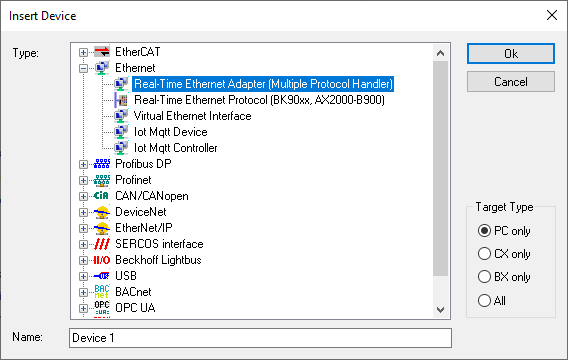
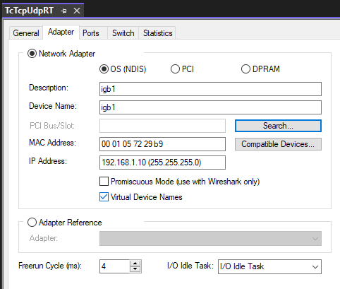
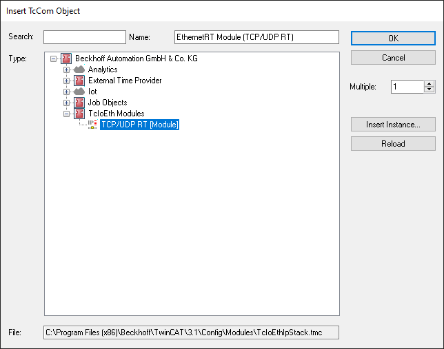
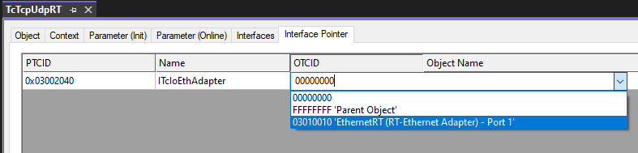
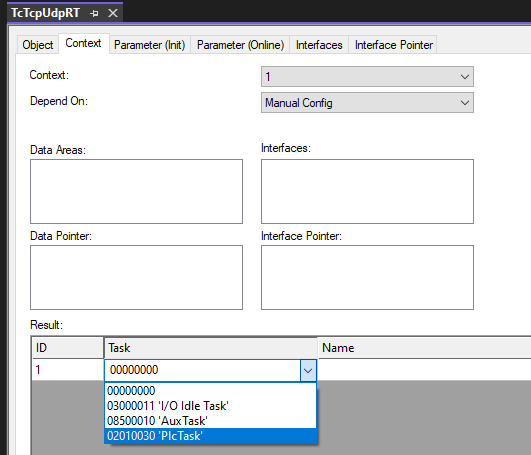
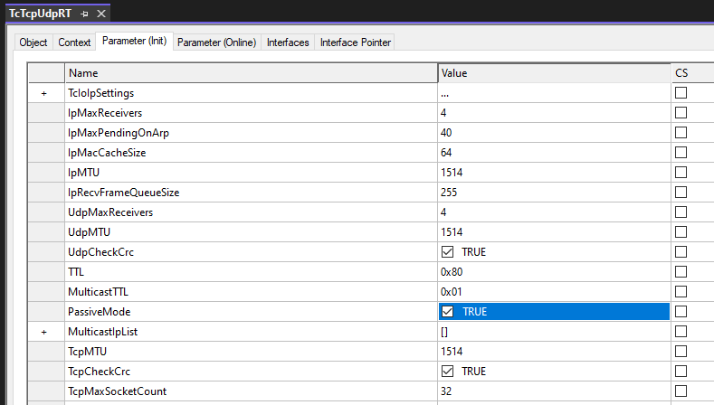
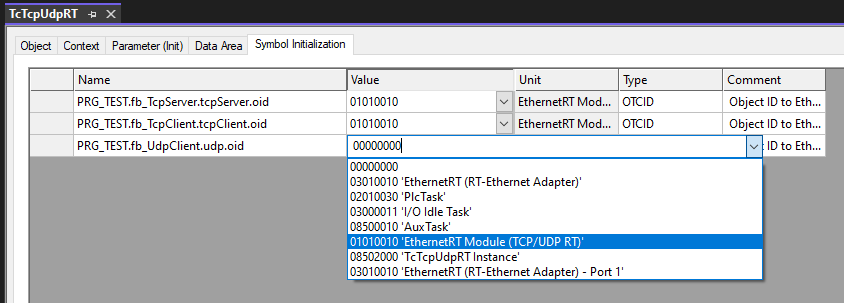

# TcTcpUdpRT

TF6311 TwinCAT 3 TCP/UDP Realtime implementation.

Build in TwinCAT 4026.20 and tested with a C6015 with TC/BSD 14.2.3.5.

- [TcTcpUdpRT](#tctcpudprt)
  - [Introduction](#introduction)
- [Setup IO](#setup-io)
  - [Multitask access](#multitask-access)
  - [Module parameters](#module-parameters)
  - [Module diagnostics](#module-diagnostics)
- [PLC code](#plc-code)
  - [Assign symbol to module](#assign-symbol-to-module)
- [Faults](#faults)

## Introduction

This library can be used for the TF6311 when you want real-time performance of your TCP/UDP. I made this library because the TF6310 could not keep with the performance when running 1ms task cycles and the UDP performance was bad.

The TF6311 lets you have direct access to the hardware, but is hard to implement and there was some error in Beckhoff documentation and the example code was outdated. The PLC code have a interface pointer to the hardware where the Ethernet RT module can interrupt the code when it receives a new message and the `ReceiveData` method can handle the message. There is no buffer from the hardware so you have to handle data in the interrupt. I have implemented a ring buffer for MEMCPY the data to a 32kB buffer where you can call the `Receive` method to get data from the ring buffer. Ring buffer size is adjustable from parameter list `TcTcpUdpRT_Param`.

The `ReceiveData` method can't push back on the TCP stack if the ring buffer is full and get the sender to retransmit the data, so the data will be lost breaking the concept of TCP. Beckhoff have agreed to add that feature. You will get an error from the FB if the buffer is full or the received message can't fit in the ring buffer.

# Setup IO

[Beckhoff documentation for Quick Start](https://infosys.beckhoff.com/english.php?content=../content/1033/tf6311_tc3_tcpudp/1412819083.html)

1. Start by adding a Real-Time Ethernet Adapter to your I/O. Right click on the `Devices` under the `I/O` and click `Add New Item...`.

    

2. Select the Ethernet adapter for the target in the `Adapter` tab.

    

   - If you are the same code to multiple IPC, you can check the `Virtual Device Names` so it will ignore the MAC address of the adapter and only use the name to find the adapter.
   - [Beckhoff documentation on Ethernet adapter](https://infosys.beckhoff.com/english.php?content=../content/1033/tc3_io_intro/1258020619.html)

3. Now you need to add the TCP/UDP RT module to the Ethernet adapter. Right click in the Ethernet adater adn click `Add Object(s)`.

    

4. Set the interface pointer for the TCP/UDP module to the point to the Ethernet adapter in the `Interface Pointer` tab.

    

5. Assign the TCP/UDP RT module to a task in the `Context` tab.

    

## Multitask access

[Beckhoff documentation for Multitask access to network card](https://infosys.beckhoff.com/english.php?content=../content/1033/tf6311_tc3_tcpudp/10404082699.html)

You can have multiple TCP/UDP RT modules on one Ethernet adapter, but only one of module should be fetching data from the network card. The module with the fastest task with a low priority should be the one to fetch data from the network card. The other modules should be set to passive mode under the `Parameter (Init)` tab.

## Module parameters

[Beckhoff documentation on TCP/UDP RT module parameters](https://infosys.beckhoff.com/english.php?content=../content/1033/tf6311_tc3_tcpudp/1076923531.html)

## Module diagnostics

[Beckhoff documentation on TCP/UDP RT module diagnostics](https://infosys.beckhoff.com/english.php?content=../content/1033/tf6311_tc3_tcpudp/1655672843.html)

# PLC code

There are 3 FB's with matching interfaces:

* TcTcpServer and ITcpServer
* TcTcpClient and ITcpClient
* TcUdpSendReceive and IUdpSendReceive

**They each have a `Run` method that needs to be called cyclic to maintain the communication between the PLC code and IO!**

## Assign symbol to module

The instance of the TcTcpServer, TcTcpClient and TcUdpSendReceive needs to be assigned to the TCP/UDP RT module.

1. Build the project so the symbols are available.

2. Go to the PLC instance and find the `Symbol Initialization` tab.

3. Set the value to the Object ID of the TCP/UDP RT module.

    

    - You can have multiple instance assigned to the same module as long as the are called by the same task.

# Faults

[Beckhoff documentation on faults](https://infosys.beckhoff.com/english.php?content=../content/1033/tf6311_tc3_tcpudp/1106587787.html)
