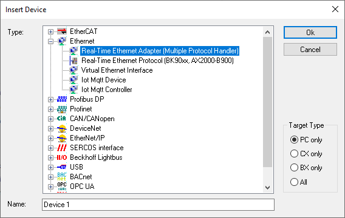
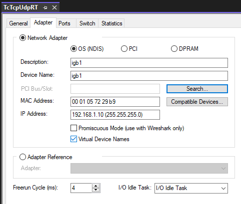
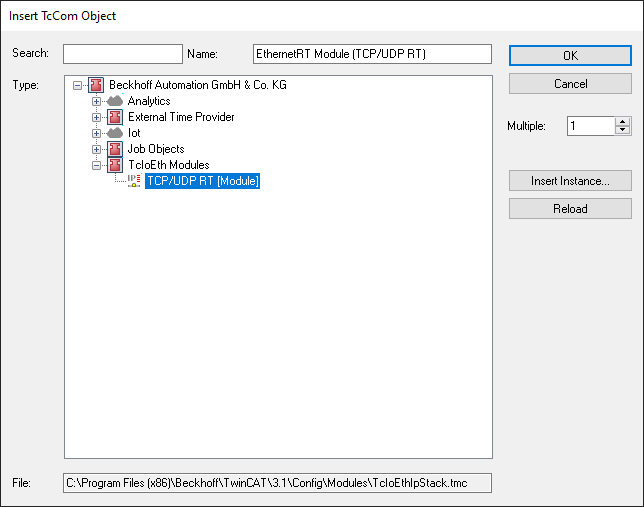
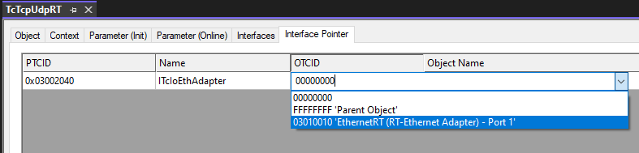
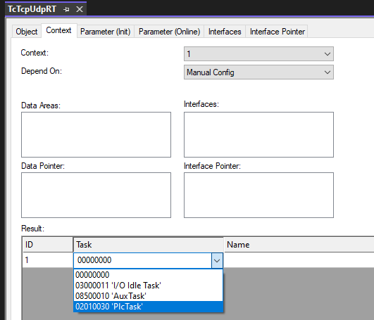
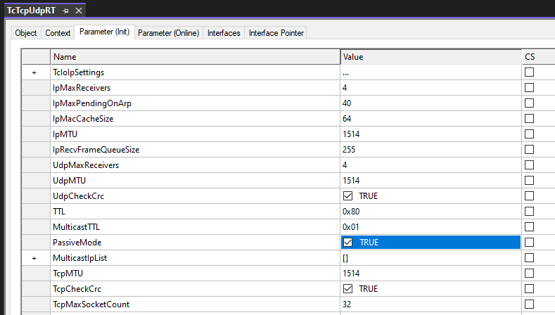
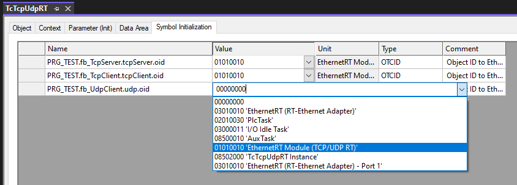

# TcTcpUdpRT

TF6311 TwinCAT 3 TCP/UDP Realtime implementation.

Build in TwinCAT 4026.20 and tested with a C6015 with TC/BSD 14.2.3.5.

- [TcTcpUdpRT](#tctcpudprt)
  - [Introduction](#introduction)
  - [Requirements](#requirements)
- [Setup IO](#setup-io)
  - [Multitask access](#multitask-access)
  - [Module parameters](#module-parameters)
  - [Module diagnostics](#module-diagnostics)
- [PLC code](#plc-code)
  - [Assign symbol to module](#assign-symbol-to-module)
  - [Limitations](#limitations)
- [Faults](#faults)

## Introduction

This library supports the TF6311 for real-time TCP/UDP communication. It was created because the TF6310 could not maintain performance in 1 ms task cycles, and its UDP performance was poor.

The TF6311 provides direct access to the hardware, but implementation is complex and some Beckhoff documentation/examples were outdated. Because the TF6311 traffic is handled directly by the hardware, the operating system does not see the packets and the OS firewall does not affect those connections. The PLC code uses an interface pointer to the hardware, allowing the Ethernet RT module to interrupt the PLC when a new message arrives. The `ReceiveData` method handles incoming message data. Because the hardware provides no receive buffer, data must be copied in the interrupt path. This library implements a ring buffer that copies incoming frames into a 32 KB buffer; the `Receive` method reads data from that ring buffer. The ring buffer size is adjustable via the `TcTcpUdpRT_Param` parameter list.

If the ring buffer is full, `ReceiveData` cannot push back on the TCP stack to force a retransmission, so the data is lost and TCP semantics are broken. Beckhoff has agreed to add support for this feature. The FB reports an error if the buffer is full or if a received message cannot fit into the ring buffer.

## Requirements

- TwinCAT 4026.12 or newer.
- TF6311 Ethernet RT license.

# Setup IO

[Beckhoff documentation for Quick Start](https://infosys.beckhoff.com/english.php?content=../content/1033/tf6311_tc3_tcpudp/1412819083.html)

1. Start by adding a Real-Time Ethernet Adapter to your I/O. Right click on the `Devices` under the `I/O` and click `Add New Item...`.

    

2. Select the Ethernet adapter for the target in the `Adapter` tab.

    

   - If you use the same code on multiple IPCs, you can check `Virtual Device Names` so the adapter selection ignores the MAC address and matches only by device name.
   - [Beckhoff documentation on Ethernet adapter](https://infosys.beckhoff.com/english.php?content=../content/1033/tc3_io_intro/1258020619.html)

3. Now you need to add the TCP/UDP RT module to the Ethernet adapter. Right click on the Ethernet adapter and click `Add Object(s)`.

    

4. Set the interface pointer for the TCP/UDP module to point to the Ethernet adapter in the `Interface Pointer` tab.

    

5. Assign the TCP/UDP RT module to a task in the `Context` tab.

    

> Note: The TCP/UDP RT module should be on the same task as the PLC code that calls its `Run` method.

## Multitask access

[Beckhoff documentation for Multitask access to network card](https://infosys.beckhoff.com/english.php?content=../content/1033/tf6311_tc3_tcpudp/10404082699.html)

You can have multiple TCP/UDP RT modules on one Ethernet adapter, but only one of module should be fetching data from the network card. The module with the fastest task with a low priority should be the one to fetch data from the network card. The other modules should be set to passive mode under the `Parameter (Init)` tab.

## Module parameters

[Beckhoff documentation on TCP/UDP RT module parameters](https://infosys.beckhoff.com/english.php?content=../content/1033/tf6311_tc3_tcpudp/1076923531.html)

## Module diagnostics

[Beckhoff documentation on TCP/UDP RT module diagnostics](https://infosys.beckhoff.com/english.php?content=../content/1033/tf6311_tc3_tcpudp/1655672843.html)

# PLC code

There are 4 FB's with matching interfaces:

* TcTcpServer and ITcpServer
* TcTcpClient and ITcpClient
* TcUdpSendReceive and IUdpSendReceive
* TcArpPing and IArpPing
  * **There is an issue with the ARP request, it does not return the MAC address is expected during testing. I will have to investigate that with Beckhoff**

**They each have a `Run` method that needs to be called cyclic to maintain the communication between the PLC code and IO!**

## Assign symbol to module

The instance of the TcTcpServer, TcTcpClient and TcUdpSendReceive needs to be assigned to the TCP/UDP RT module.

1. Build the project so the symbols are available.

2. Go to the PLC instance and find the `Symbol Initialization` tab.

3. Set the value to the Object ID of the TCP/UDP RT module.

    

    - You can have multiple instances assigned to the same module as long as they are called by the same task.

## Limitations

- The `ReceiveData` method cannot currently push back on the TCP stack if the ring buffer is full, so lost packets may occur.
- The currently implemented TCP behavior can break TCP semantics when the ring buffer overflows.
- The TF6311 traffic bypasses the OS network stack, so the OS firewall does not affect TCP/UDP connections handled by this module.
- There is a known issue with `TcArpPing` where the ARP request does not return the expected MAC address during testing.
- Module parameters such as buffer size and passive mode are important when using multiple modules on the same adapter.

# Faults

[Beckhoff documentation on faults](https://infosys.beckhoff.com/english.php?content=../content/1033/tf6311_tc3_tcpudp/1106587787.html)
